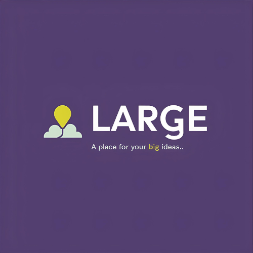
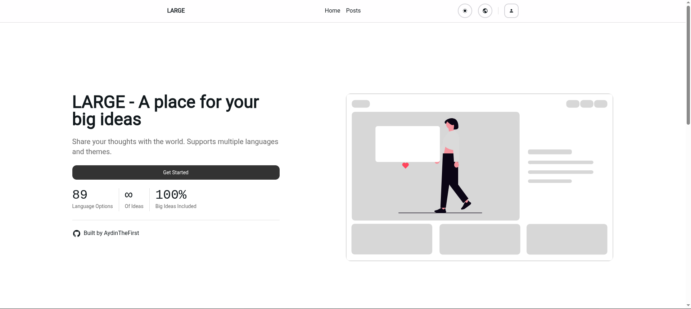
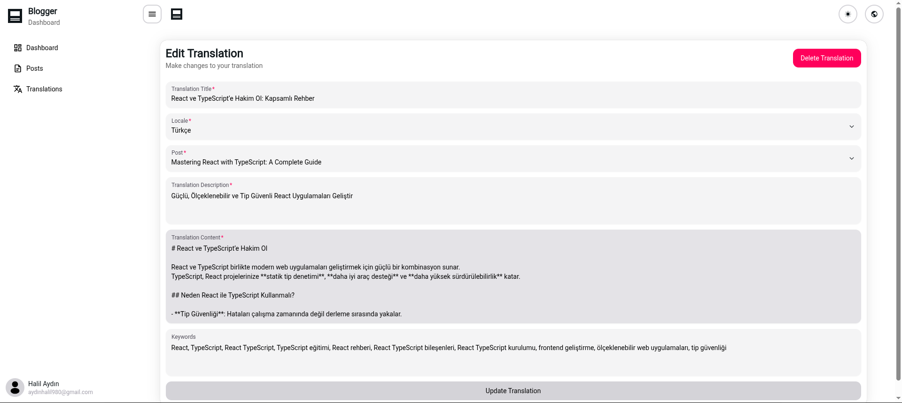
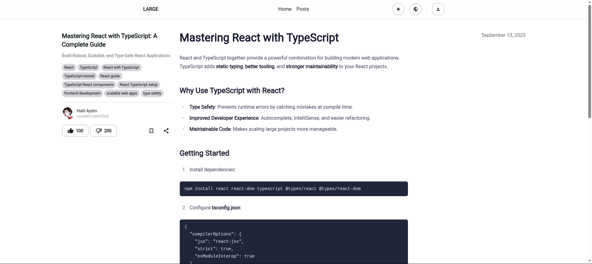

# LARGE - Modern Blog Platform

A full-stack blog application built with cutting-edge technologies for seamless content creation and management. Experience the power of modern web development with internationalization, authentication, and a responsive design. Perfect for developers and content creators looking to build scalable blog platforms.

## 🌟 Features

- **Multi-language Support**: Built-in internationalization with Intlayer for global reach.
- **User Authentication**: Secure login with JWT and Google OAuth integration.
- **Responsive Design**: Mobile-first UI using HeroUI and Tailwind CSS.
- **Content Management**: Create, edit, and manage posts with rich text support.
- **Real-time Updates**: Smooth animations with Framer Motion for an engaging user experience.
- **Database Integration**: Robust backend with Prisma and PostgreSQL.
- **State Management**: Efficient client-side state with Zustand.

## 🚀 Technologies Used

- **Frontend**: React 19, TypeScript, Vite, HeroUI, Framer Motion
- **Backend**: NestJS, Prisma, PostgreSQL
- **State Management**: Zustand
- **Internationalization**: Intlayer
- **Styling**: Tailwind CSS
- **Authentication**: JWT, Google OAuth
- **Deployment**: Turborepo for monorepo management

## 📸 Screenshots

### Homepage

_Clean and modern landing page with hero section and feature highlights._

### Dashboard

_User dashboard for managing posts and translations._

### Post View

_Detailed post view with author info and interactive elements._

## 🌐 Live Preview

Check out the live demo at [large.aydinthefirst.com](https://large.aydinthefirst.com)

## 📦 Repository

Explore the codebase on GitHub: [AydinTheFirst/large-app](https://github.com/AydinTheFirst/large-app)

This project showcases modern web development practices, from scalable architecture to user-friendly interfaces. Share your big ideas with LARGE! 🚀
